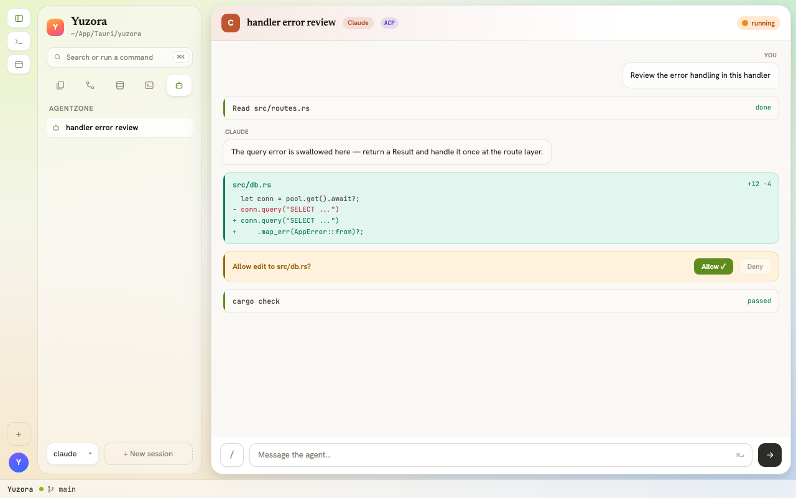
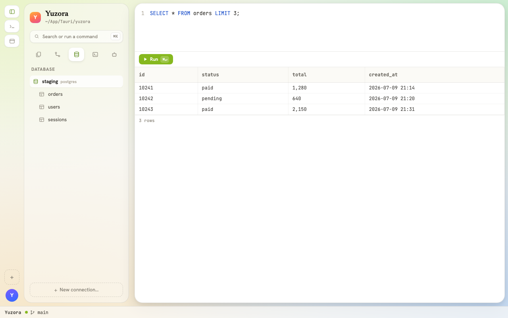
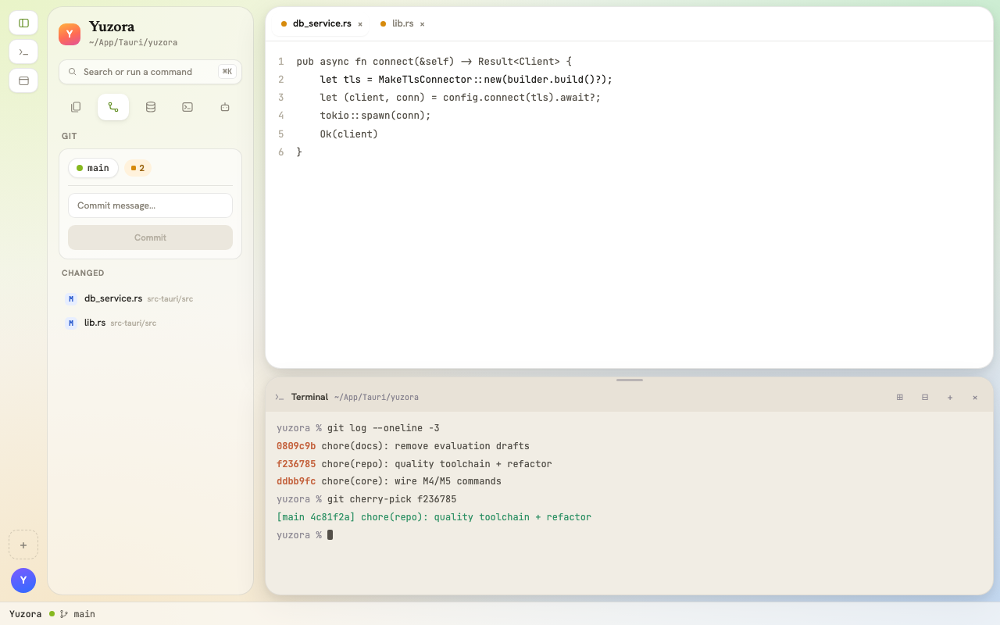

<div align="center">


# Yuzora

**Agents, remotes and data — all on one desk.**

<samp>A desktop dev workbench that unifies ACP agents, SSH, databases and a terminal</samp>

<br />

[](https://github.com/NakiriYuuzu/Yuzora/actions/workflows/ci.yml)
[](https://nakiriyuuzu.github.io/Yuzora/)


<samp>English · <a href="README.zh-TW.md">繁體中文</a> · <a href="https://nakiriyuuzu.github.io/Yuzora/">Website</a></samp>

<br />
<br />


</div>

<br />

> Editor, agent, remote connections, databases, terminal — everything you actually
> keep open while developing, in **one workbench sharing one workspace context**.
> Built with Tauri: quick to launch, local-first — your credentials and code never
> leave your machine.

<br />

## Features

<table>
<tr>
<td valign="middle" width="38%">

<sub><samp>01 · AGENTZONE</samp></sub>

### Work alongside ACP agents

Connect Claude Code, Codex and other agents over the Agent Client Protocol. Agents see the workspace you're looking at; replies, diffs and tool calls stream into the panel, with per-action permission prompts.

<code>ACP</code> <code>claude-code</code> <code>codex</code> <code>permissions</code>

</td>
<td valign="middle" width="62%">



</td>
</tr>
</table>

<table>
<tr>
<td valign="middle" width="62%">



</td>
<td valign="middle" width="38%">

<sub><samp>02 · SSH & DATABASES</samp></sub>

### Remote feels local

Browse and edit files over SSH with SFTP transfer; query tables, run SQL and inspect schemas in the database panel. Connections are managed in one place — known hosts and credentials stay on your machine.

<code>SSH / SFTP</code> <code>PostgreSQL</code> <code>MySQL</code> <code>SQLite</code>

</td>
</tr>
</table>

<table>
<tr>
<td valign="middle" width="38%">

<sub><samp>03 · TERMINAL & GIT</samp></sub>

### Built-in terminal & git tools

An xterm-powered terminal drawer sits right under the editor; the git panel shows history and diffs, with cherry-pick straight from commit details. Log query and export keep debugging inside the workbench.

<code>xterm + pty</code> <code>git log / cherry-pick</code> <code>log query</code>

</td>
<td valign="middle" width="62%">



</td>
</tr>
</table>

<br />

## Download

Every build is produced by GitHub Actions and published on [GitHub Releases](https://github.com/NakiriYuuzu/Yuzora/releases) — the source is open.

| Platform | Format | Download |
|:--|:--|:--|
| **macOS** | `.dmg` — universal (Apple Silicon / Intel) | [Yuzora-macos-universal.dmg](https://github.com/NakiriYuuzu/Yuzora/releases/latest/download/Yuzora-macos-universal.dmg) |
| **Windows** | `.exe` (NSIS) — x64 | [Yuzora-windows-x64-setup.exe](https://github.com/NakiriYuuzu/Yuzora/releases/latest/download/Yuzora-windows-x64-setup.exe) |
| **Linux** | `.AppImage` — x86_64 | [Yuzora-linux-x86_64.AppImage](https://github.com/NakiriYuuzu/Yuzora/releases/latest/download/Yuzora-linux-x86_64.AppImage) |

Other installer formats (`.msi` / `.deb` / `.rpm`) and past versions live on [GitHub Releases](https://github.com/NakiriYuuzu/Yuzora/releases).

## Tech stack

| Layer | Tech |
|:--|:--|
| Desktop shell | [Tauri 2](https://tauri.app) (Rust) |
| Frontend | React + TypeScript + Vite |
| Agent integration | [Agent Client Protocol](https://agentclientprotocol.com) (`@agentclientprotocol/sdk`) |
| Terminal | xterm.js + pty |
| Toolchain | Bun · Vitest · Cargo |

## Development

```bash
bun install          # install dependencies
bun run tauri:dev    # launch the desktop app (dev server :1420)
bun run test         # vitest
bun run build        # frontend build (incl. tsc)
cd src-tauri && cargo check   # Rust check
```

Build installers from source:

```bash
bun install && bun run tauri:build
```

> The product animation and screenshots in this README and on the
> [website](https://nakiriyuuzu.github.io/Yuzora/) are rendered programmatically by the
> [Remotion](https://www.remotion.dev) project in [`site-remotion/`](site-remotion/),
> with design tokens aligned 1:1 to the app itself.

<br />

---

<div align="center">

**Your whole dev day, on one desk.**

<samp>a dev workbench under the evening sky</samp>

<sub>

[Source](https://github.com/NakiriYuuzu/Yuzora) · [Issues](https://github.com/NakiriYuuzu/Yuzora/issues) · [Releases](https://github.com/NakiriYuuzu/Yuzora/releases) · [Website](https://nakiriyuuzu.github.io/Yuzora/)

</sub>

</div>
