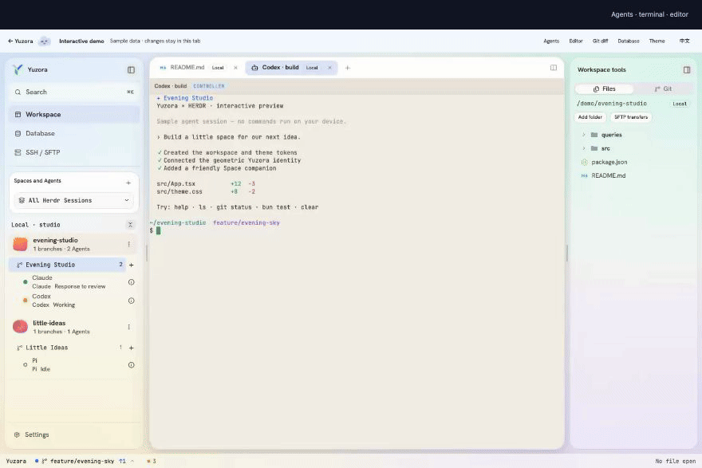
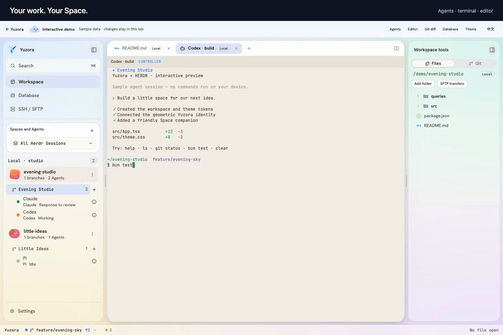
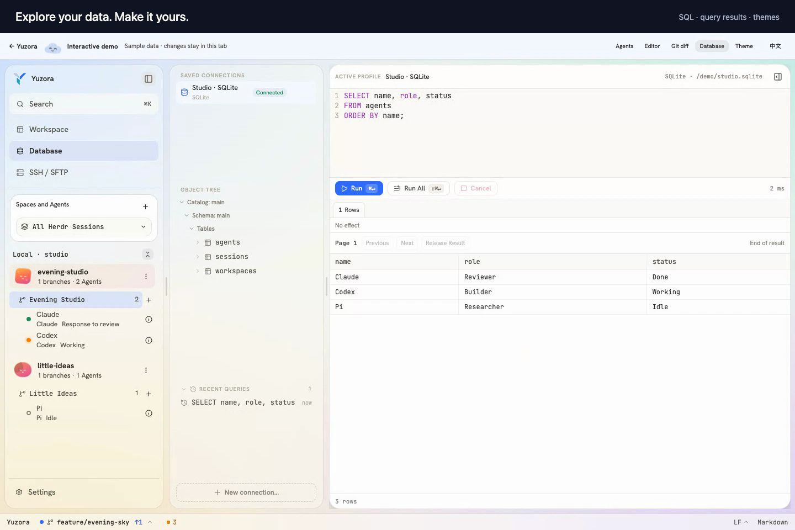
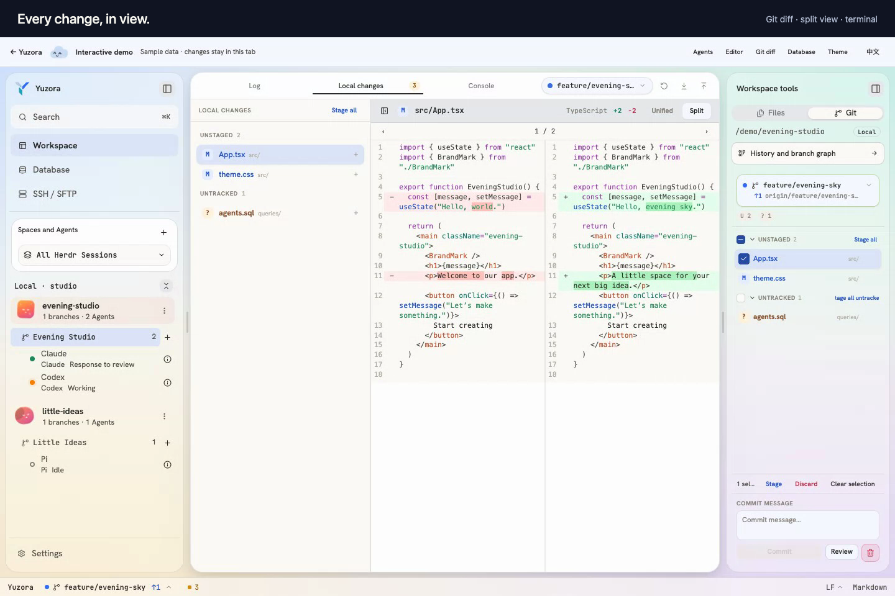

<div align="center">


# Yuzora

**Build with agents. Run on HERDR.**

<samp>An open-source desktop ADE fused with the HERDR runtime</samp>

<br />

[](https://github.com/NakiriYuuzu/Yuzora/actions/workflows/ci.yml)
[](https://github.yuuzu.net/Yuzora/)


<samp>English · <a href="README.zh-TW.md">繁體中文</a> · <a href="https://github.yuuzu.net/Yuzora/">Website</a></samp>

<br />
<br />



</div>

<br />

> Yuzora is an **Agent Development Environment (ADE)** built around HERDR as its
> execution and terminal runtime. Spaces, named Sessions, Attention and Agents are
> projected into one desktop surface, while editor, git, SSH/SFTP, databases and a
> browser remain close at hand. Built with Tauri and local-first by default.

<br />

## Features

### What's new in v0.0.9

- Faster Git status, branch lists and diff loading; smoother switching between open HERDR terminals while keeping their output and connections.
- Themed editor and diff scrollbars, a resizable database sidebar, and a clear commit history / branch graph button.
- Whole-block multiline paste, optional copy on selection, and Option/Alt+V image paste to the terminal's host.
- Native Windows HERDR, opt-in WSL, and safer workspace trust, paths and reconnection across local and SSH hosts.
- Updated branding and an [interactive browser demo](https://github.yuuzu.net/Yuzora/demo/) deployed with the website through GitHub Actions Pages.

See the [Changelog](CHANGELOG.md) for the complete release notes and limitations.

<table>
<tr>
<td valign="middle" width="38%">

<sub><samp>01 · ADE × HERDR</samp></sub>

### From Space to agent terminal

The Space and Agent sidebar projects HERDR Spaces, named Sessions, Attention and Agents. Selecting an agent focuses its owning Session and Space, then opens the corresponding HERDR terminal page. Each Yuzora page maps to one HERDR tab and recursively renders its BSP panes. Mutating actions are capability-gated, and Agent Inspector is read-only.

<code>Spaces</code> <code>named Sessions</code> <code>BSP terminal</code> <code>read-only Inspector</code>

</td>
<td valign="middle" width="62%">



</td>
</tr>
</table>

<table>
<tr>
<td valign="middle" width="62%">



</td>
<td valign="middle" width="38%">

<sub><samp>02 · SSH & DATABASES</samp></sub>

### Remote feels local

Browse and edit files over SSH with SFTP transfer; query tables, run SQL and inspect schemas in the database panel. Connections are managed in one place — known hosts and credentials stay on your machine.

<code>SSH / SFTP</code> <code>PostgreSQL</code> <code>SQL Server</code> <code>SQLite</code>

</td>
</tr>
</table>

<table>
<tr>
<td valign="middle" width="38%">

<sub><samp>03 · TERMINAL & GIT</samp></sub>

### Built-in terminal & git tools

HERDR terminal pages provide xterm-powered input, output and split panes; the git panel shows history and diffs, with cherry-pick straight from commit details. Log query and export keep debugging inside the workbench.

<code>xterm + HERDR</code> <code>git log / cherry-pick</code> <code>log query</code>

</td>
<td valign="middle" width="62%">



</td>
</tr>
</table>

<br />

## Download

Stable releases are built by GitHub Actions and published on [GitHub Releases](https://github.com/NakiriYuuzu/Yuzora/releases). Unpublished PR candidates are available only as Actions artifacts.

| Platform | Format | Download |
|:--|:--|:--|
| **macOS** | `.dmg` — Apple Silicon (M series) only | [Yuzora-macos-aarch64.dmg](https://github.com/NakiriYuuzu/Yuzora/releases/latest/download/Yuzora-macos-aarch64.dmg) |
| **Windows** | `.exe` (NSIS) — x64 | [Yuzora-windows-x64-setup.exe](https://github.com/NakiriYuuzu/Yuzora/releases/latest/download/Yuzora-windows-x64-setup.exe) |

The Windows `.msi` installer and past versions live on [GitHub Releases](https://github.com/NakiriYuuzu/Yuzora/releases). Linux is used as a CI/test host only and is not a supported Yuzora desktop release platform.

Starting with v0.0.9, the macOS App requires Apple Silicon. Intel macOS remote Hosts remain supported.

macOS downloads are **not Apple Developer ID signed or notarized**. Gatekeeper may warn or block the first launch. Download from the official release above, then use macOS **System Settings → Privacy & Security → Open Anyway** if offered after the first launch attempt. Windows may show SmartScreen because Authenticode signing is not enabled. Stable updates still verify Tauri updater signatures.

## Tech stack

| Layer | Tech |
|:--|:--|
| Desktop shell | [Tauri 2](https://tauri.app) (Rust) |
| Frontend | React + TypeScript + Vite |
| Agent runtime | HERDR public API + official terminal session connector |
| Terminal | xterm.js + HERDR terminal pages |
| Toolchain | Bun · Vitest · Cargo |

Yuzora bundles HERDR 0.9.0. In Settings → HERDR, each host can use a Yuzora-managed, installed or custom binary with compatibility checks and diagnostics. Windows uses native HERDR by default; WSL is opt-in, and each workspace runs on its selected local, WSL or SSH host. Pure SFTP connections do not require a runtime. Closing Yuzora releases its own helpers and connectors while preserving HERDR servers and agents. Existing host paths are retained on upgrade; update the selected source explicitly in settings.

Agents are started manually in HERDR terminals. The old WSL Pi plugin, separate local/SSH terminals and LSP settings have been removed. The browser opens websites and services you start in a terminal.

### Interactive web demo

The [website](https://github.yuuzu.net/Yuzora/) includes an [interactive demo](https://github.yuuzu.net/Yuzora/demo/) with sample terminals, files, Git diffs and databases. It uses in-memory data and does not connect to your computer or remote hosts. Build it with `bun run demo:build`; GitHub Actions deploys the website and demo together to Pages.

## Development

```bash
bun install          # install dependencies
bun run tauri:dev    # launch the desktop app (dev server :1420)
bun run site:companions # generate website characters
bun run demo:build   # prepare Pages artifact for tests
bun run test         # vitest
bun run build        # frontend build (incl. typecheck)
cd src-tauri
cargo check          # Rust check
```

Build installers from source:

```bash
bun install
bun run tauri:build
```

This local build disables updater artifacts and signing, so it does not require production
secrets. Stable releases retain updater signatures; macOS Apple signing and notarization are
not enabled. See [the operations guide](docs/operations.md) for release and verification steps.

> README and [website](https://github.yuuzu.net/Yuzora/) media are rendered by
> [Remotion](https://www.remotion.dev) from recordings of the current AppShell demo.
> The recordings use sample data, not a live host. Sources and repeatable render
> commands are in [`site-remotion/`](site-remotion/).

<br />

---

<div align="center">

**An ADE fused with the HERDR runtime.**

<samp>agent development under the evening sky</samp>

<sub>

[Source](https://github.com/NakiriYuuzu/Yuzora) · [Issues](https://github.com/NakiriYuuzu/Yuzora/issues) · [Releases](https://github.com/NakiriYuuzu/Yuzora/releases) · [Website](https://github.yuuzu.net/Yuzora/)

</sub>

</div>
