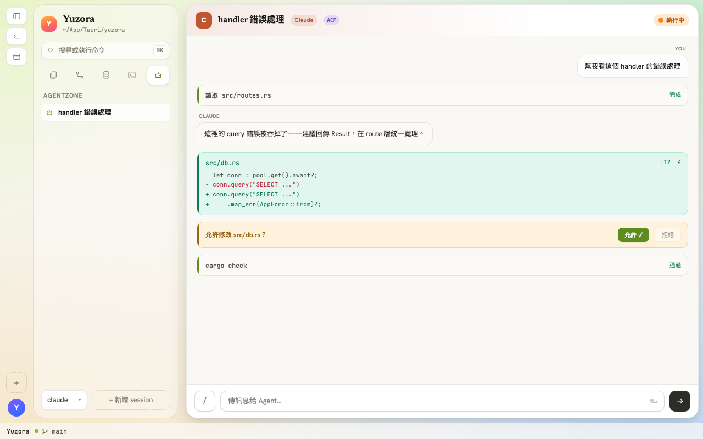
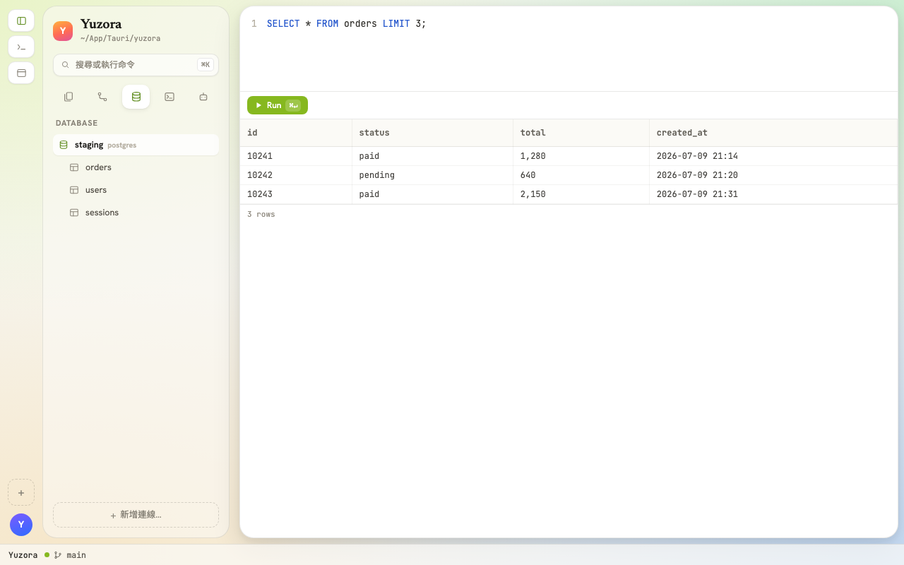
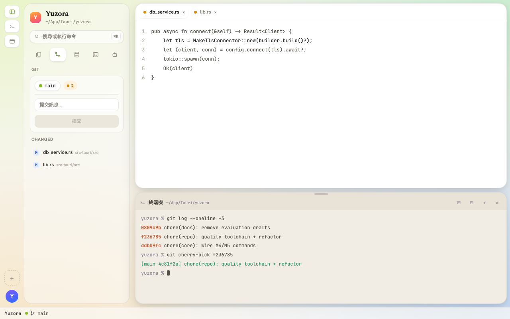

<div align="center">


# Yuzora

**把 agent、遠端與資料，收進同一張桌面。**

<samp>整合 ACP agent、SSH、資料庫與 terminal 的桌面開發工作台</samp>

<br />

[](https://github.com/NakiriYuuzu/Yuzora/actions/workflows/ci.yml)
[](https://nakiriyuuzu.github.io/Yuzora/)


<samp><a href="README.md">English</a> · 繁體中文 · <a href="https://nakiriyuuzu.github.io/Yuzora/">官方網站</a></samp>

<br />
<br />


</div>

<br />

> 編輯器、agent、遠端連線、資料庫、terminal——開發時真正會開著的東西，
> Yuzora 把它們放進同一個工作台，共用同一份 workspace 脈絡，**不用再開四個視窗**。
> 以 Tauri 打造：輕量啟動、在地執行，你的憑證與程式碼不離開你的機器。

<br />

## 功能

<table>
<tr>
<td valign="middle" width="38%">

<sub><samp>01 · AGENTZONE</samp></sub>

### ACP agent 並肩工作

透過 Agent Client Protocol 接上 Claude Code、Codex 等 agent。agent 讀得到你正在看的 workspace，回覆、diff 與工具呼叫都在側欄即時呈現，權限逐項確認。

<code>ACP</code> <code>claude-code</code> <code>codex</code> <code>權限控管</code>

</td>
<td valign="middle" width="62%">



</td>
</tr>
</table>

<table>
<tr>
<td valign="middle" width="62%">



</td>
<td valign="middle" width="38%">

<sub><samp>02 · SSH ＆ 資料庫</samp></sub>

### 遠端即在地

SSH 連上遠端主機瀏覽與編輯檔案、SFTP 傳輸；資料庫面板直接查表、下 query、看結構。連線設定集中管理，known hosts 與憑證都留在本機。

<code>SSH / SFTP</code> <code>PostgreSQL</code> <code>MySQL</code> <code>SQLite</code>

</td>
</tr>
</table>

<table>
<tr>
<td valign="middle" width="38%">

<sub><samp>03 · TERMINAL ＆ GIT</samp></sub>

### 內建 terminal 與 git 工具

xterm 驅動的 terminal drawer 就在編輯器下方；git 面板看歷史、看 diff、從 commit 細節直接 cherry-pick。log 查詢與匯出讓除錯不用離開工作台。

<code>xterm + pty</code> <code>git log / cherry-pick</code> <code>log 查詢</code>

</td>
<td valign="middle" width="62%">



</td>
</tr>
</table>

<br />

## 下載

所有版本皆由 GitHub Actions 建置並發佈於 [GitHub Releases](https://github.com/NakiriYuuzu/Yuzora/releases)，原始碼公開可查。

| 平台 | 格式 | 下載 |
|:--|:--|:--|
| **macOS** | `.dmg` — universal（Apple Silicon / Intel） | [Yuzora-macos-universal.dmg](https://github.com/NakiriYuuzu/Yuzora/releases/latest/download/Yuzora-macos-universal.dmg) |
| **Windows** | `.exe`（NSIS）— x64 | [Yuzora-windows-x64-setup.exe](https://github.com/NakiriYuuzu/Yuzora/releases/latest/download/Yuzora-windows-x64-setup.exe) |
| **Linux** | `.AppImage` — x86_64 | [Yuzora-linux-x86_64.AppImage](https://github.com/NakiriYuuzu/Yuzora/releases/latest/download/Yuzora-linux-x86_64.AppImage) |

其他安裝格式（`.msi`／`.deb`／`.rpm`）與歷史版本見 [GitHub Releases](https://github.com/NakiriYuuzu/Yuzora/releases)。

## 技術架構

| 層 | 技術 |
|:--|:--|
| 桌面框架 | [Tauri 2](https://tauri.app)（Rust） |
| 前端 | React + TypeScript + Vite |
| Agent 介接 | [Agent Client Protocol](https://agentclientprotocol.com)（`@agentclientprotocol/sdk`） |
| Terminal | xterm.js + pty |
| 工具鏈 | Bun · Vitest · Cargo |

## 開發

```bash
bun install          # 安裝依賴
bun run tauri:dev    # 啟動桌面 app（dev server :1420）
bun run test         # vitest
bun run build        # 前端建置（含 tsc）
cd src-tauri && cargo check   # Rust 檢查
```

從原始碼建置安裝檔：

```bash
bun install && bun run tauri:build
```

> README 與[官方網站](https://nakiriyuuzu.github.io/Yuzora/)中的產品動畫與截圖，
> 均由 [`site-remotion/`](site-remotion/) 內的 [Remotion](https://www.remotion.dev) 專案程式化渲染，
> 與 app 本體的 design tokens 1:1 對齊。

<br />

---

<div align="center">

**把整個開發日常，收進一張桌面。**

<samp>夕空下的開發工作台</samp>

<sub>

[原始碼](https://github.com/NakiriYuuzu/Yuzora) · [回報問題](https://github.com/NakiriYuuzu/Yuzora/issues) · [所有版本](https://github.com/NakiriYuuzu/Yuzora/releases) · [官方網站](https://nakiriyuuzu.github.io/Yuzora/)

</sub>

</div>
