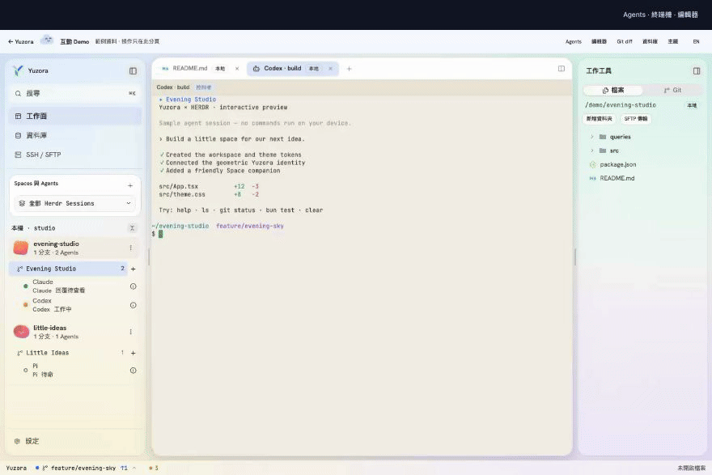
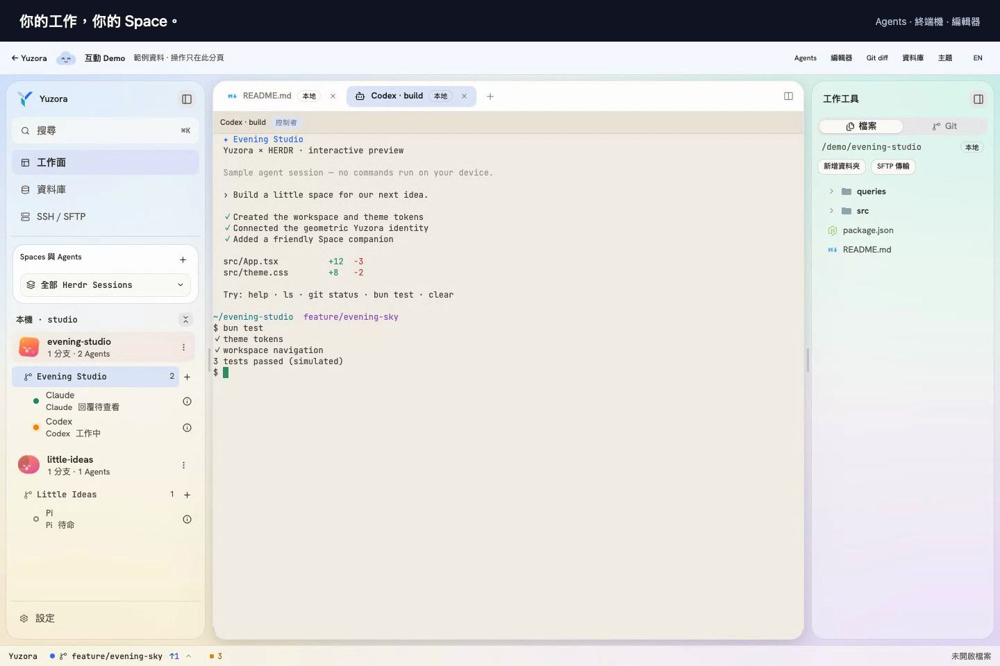
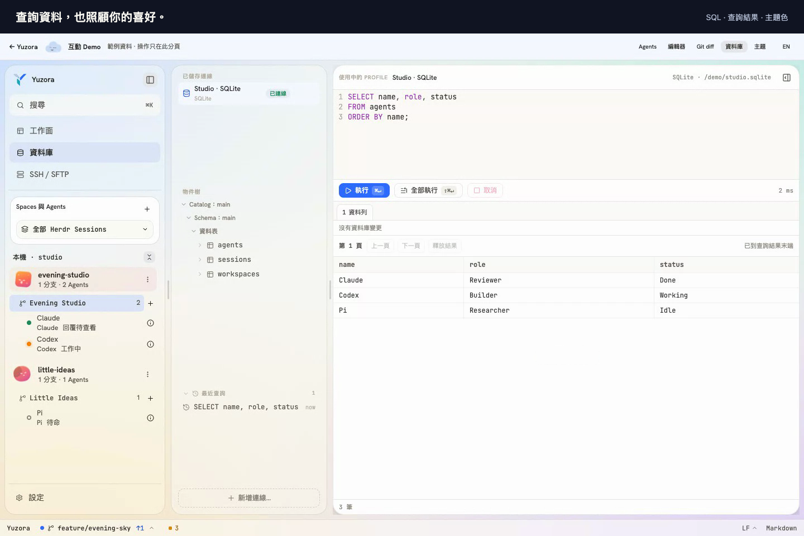
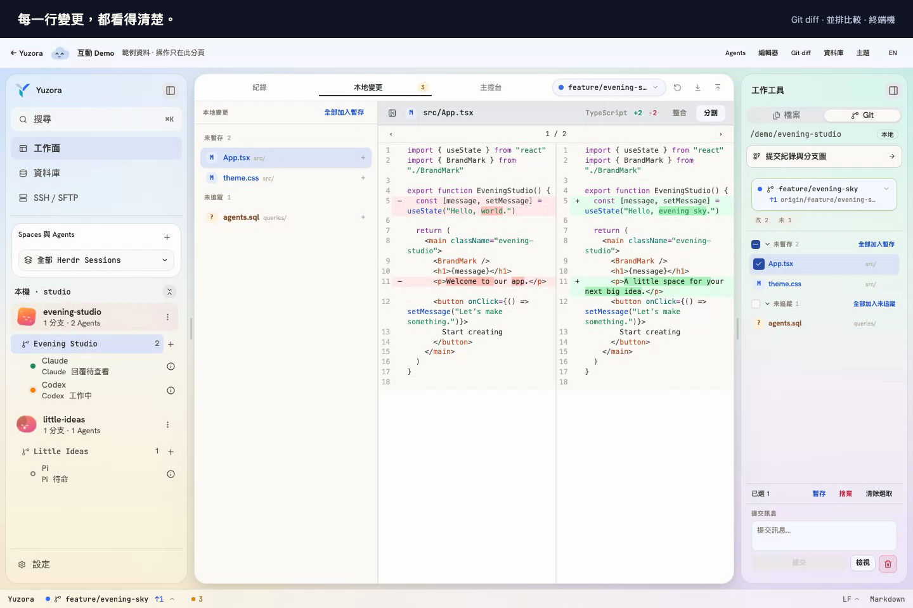

<div align="center">


# Yuzora

**讓 agent 開發，直接運轉在 HERDR。**

<samp>macOS 與 Windows 的 AI 程式開發工作區，以 HERDR 驅動</samp>

<br />

[](https://github.com/NakiriYuuzu/Yuzora/actions/workflows/ci.yml)
[](https://github.yuuzu.net/Yuzora/)


<samp><a href="README.md">English</a> · 繁體中文 · <a href="https://github.yuuzu.net/Yuzora/">官方網站</a></samp>

<br />
<br />



</div>

<br />

> Yuzora 是以 Tauri 打造的 **AI 程式開發工作區，支援 macOS 與 Windows**。
> 在可持續執行的 HERDR 終端 Session 使用 Claude Code、Codex、Pi 等 CLI coding agents，
> 並在同一個桌面 App 操作程式編輯器、Git diff、SSH／SFTP、WSL、SQL 資料庫與 HTML 預覽。
> 預設在地執行；Agent CLI 與使用帳號由使用者自行管理。

<br />

## 功能

### v0.0.16 更新

- HERDR 工具：Worktrees、pane 搬移、Agents、Integrations、Sessions 與 Plugins，並提供選配的 Agent 通知及「開啟 Herdr 視窗」。
- 支援 Windows x86_64 SSH 主機：獨立 helper、named pipe 與原生路徑。
- 重整資料庫工作台，支援連線後選庫、雙擊編輯欄位與右鍵編輯資料表結構。
- 大型文件背景搜尋、資料列虛擬化、Spaces／Agents 穩定排序與資源釋放。
- 修正 SSH 密碼驗證與新 repo 取消暫存；改善 Git 分支提示及 Graph 作者／日期顯示。

### v0.0.15 更新

- 可設定頁籤快捷鍵，包含 Ctrl+Tab 與直接選取第 1～9 個頁籤。
- 預覽本機、WSL 與 SSH 工作區已儲存的 HTML；在瀏覽器選取元素並複製 AI 修改所需的上下文。
- 整合 HERDR 0.9.1，修正終端焦點與渲染問題、Git 操作與 WSL 存檔誤報。

### v0.0.13 更新

- Stable 與 Preview 更新檢查會依 SemVer 選擇最新簽章版本，並相容尚未提供新原生命令的舊版 Yuzora。
- WSL 資料夾開啟在 Shell 選取無法將 Explorer 帶到前景時，會 fallback 到 `\\wsl.localhost`／`\\wsl$` 命名空間。

### v0.0.10 更新

- 工作工具整合為「檔案｜GIT」卡片，支援建立檔案／資料夾、複製完整路徑，以及使用 Finder 或 Explorer 開啟。
- Git Graph 支援依分支數量動態延伸與水平捲動，大型文件連續渲染，HERDR、diff 與 minimap 捲軸可直接操作。
- 新增快捷鍵設定與 GitHub、Yuzora、One 語法配色主題，補齊常見語言與副檔名映射。

- 加快 Git 狀態、分支與 diff 載入；切換已開啟 HERDR 終端機更流暢，保留輸出與連線。
- 外觀設定新增可保存的 Bot 動畫開關；低規格裝置預設顯示靜態夥伴，並遵循系統減少動態效果設定。
- 編輯器／diff 主題捲軸、可調整寬度的資料庫側欄，以及清楚的提交紀錄／分支圖按鈕。
- 多行整段貼上、可選擇的選取自動複製，以及 Option／Alt+V 將圖片貼到終端機所在主機。
- Windows 原生 HERDR、可選擇啟用的 WSL，以及本機／SSH 主機間的工作區信任、路徑與重連改善。
- 更新品牌，加入[網頁互動 Demo](https://github.yuuzu.net/Yuzora/demo/)，與官網一起透過 GitHub Actions Pages 部署。

完整更新與限制見 [Changelog](CHANGELOG.md)。

<table>
<tr>
<td valign="middle" width="38%">

<sub><samp>01 · ADE × HERDR</samp></sub>

### 從 Space 到 agent 終端

Space 與 Agent 側欄投影 HERDR Spaces、named Sessions、Attention 與 Agents。選擇 agent 時，Yuzora 會聚焦其 Session 與 Space，再開啟對應的 HERDR terminal page。每個 Yuzora page 對應一個 HERDR tab，並遞迴呈現 BSP panes。所有 mutation 依 capability 開放，Agent Inspector 維持唯讀。

<code>Spaces</code> <code>named Sessions</code> <code>BSP terminal</code> <code>唯讀 Inspector</code>

</td>
<td valign="middle" width="62%">



</td>
</tr>
</table>

<table>
<tr>
<td valign="middle" width="62%">



</td>
<td valign="middle" width="38%">

<sub><samp>02 · SSH ＆ 資料庫</samp></sub>

### 遠端即在地

SSH 連上遠端主機瀏覽與編輯檔案、SFTP 傳輸；資料庫面板直接查表、下 query、看結構。連線設定集中管理，known hosts 與憑證都留在本機。

<code>SSH / SFTP</code> <code>PostgreSQL</code> <code>SQL Server</code> <code>SQLite</code>

</td>
</tr>
</table>

<table>
<tr>
<td valign="middle" width="38%">

<sub><samp>03 · TERMINAL ＆ GIT</samp></sub>

### 內建 terminal 與 git 工具

HERDR terminal pages 提供 xterm 輸入輸出與分割面板；git 面板看歷史、看 diff、從 commit 細節直接 cherry-pick。log 查詢與匯出讓除錯不用離開工作台。

<code>xterm + HERDR</code> <code>git log / cherry-pick</code> <code>log 查詢</code>

</td>
<td valign="middle" width="62%">



</td>
</tr>
</table>

<br />

## 下載

正式版由 GitHub Actions 建置並發佈於 [GitHub Releases](https://github.com/NakiriYuuzu/Yuzora/releases)。未發布的 PR 候選版只提供 Actions artifacts。

| 平台 | 格式 | 下載 |
|:--|:--|:--|
| **macOS** | `.dmg` — 僅支援 Apple Silicon（M 系列） | [Yuzora-macos-aarch64.dmg](https://github.com/NakiriYuuzu/Yuzora/releases/latest/download/Yuzora-macos-aarch64.dmg) |
| **Windows** | `.exe`（NSIS）— x64 | [Yuzora-windows-x64-setup.exe](https://github.com/NakiriYuuzu/Yuzora/releases/latest/download/Yuzora-windows-x64-setup.exe) |

Windows `.msi` 安裝檔與歷史版本見 [GitHub Releases](https://github.com/NakiriYuuzu/Yuzora/releases)。Linux 僅作為 CI／測試 host，不是 Yuzora 支援的桌面發佈平台。

從 v0.0.9 起，macOS App 僅支援 Apple Silicon；Intel macOS 遠端 Host 保留支援。

macOS 安裝檔**未經 Apple Developer ID 簽章或公證**，首次開啟可能被 Gatekeeper 提示或阻擋。請從上述官方 Release 下載，嘗試開啟後，依 macOS「系統設定 → 隱私權與安全性」提供的「仍要打開」流程操作。Windows 尚未啟用 Authenticode，可能出現 SmartScreen 提示。正式版自動更新仍會驗證 Tauri updater 簽章。

## 技術架構

| 層 | 技術 |
|:--|:--|
| 桌面框架 | [Tauri 2](https://tauri.app)（Rust） |
| 前端 | React + TypeScript + Vite |
| Agent runtime | HERDR public API ＋官方 terminal session connector |
| Terminal | xterm.js ＋ HERDR terminal pages |
| 工具鏈 | Bun · Vitest · Cargo |

Yuzora 隨附 HERDR 0.9.1，透過 private protocol 22 與 schema 檢查保留 0.9.0 相容性。在「設定 → HERDR」可為各主機選用 Yuzora 管理、已安裝或自訂 binary，並檢查相容性與診斷。Windows 預設使用原生 HERDR，WSL 需明確啟用；每個工作區在所選本機、WSL 或 SSH 主機執行，純 SFTP 不需要 runtime。關閉 Yuzora 只釋放自身 helper 與 connector，保留 HERDR server 與 Agent。升級時保留既有主機路徑，請在設定明確更新所選來源。

側欄的「HERDR 工具」可管理 Worktrees、搬移 panes、啟動與控制 Agents、安裝／更新 Integrations、管理執行中或已停止的 Sessions，以及安裝、啟停與移除 Plugins。背景 Agent 完成或需要輸入時，可顯示 toast、系統通知與聲音；系統通知需在工具中啟用並取得作業系統權限。

「開啟 Herdr 視窗」內嵌官方 HERDR 介面，提供歷史搜尋、鍵盤 Copy mode、Kitty 圖片與外掛彈窗。預設按 Ctrl+B 後按 [ 進入 Copy mode，再用 / 搜尋、v 選取、y 複製；自訂快捷鍵以 HERDR 設定為準。一般 pane connectors 在 Herdr 視窗開啟期間暫停；關閉畫面後恢復連線，執行中的工作持續保留。Windows x86_64 SSH 主機使用獨立 helper 與 named pipe，可保留原生路徑。部署與驗收限制見 [操作文件](docs/operations.md)。

Agent 也可在 HERDR 終端機手動啟動。舊 WSL Pi Plugin、獨立本機／SSH shell 與 LSP 設定已移除；Browser 可開啟網站及自行在終端機啟動的服務。

### 網頁互動 Demo

[官網](https://github.yuuzu.net/Yuzora/)提供[互動 Demo](https://github.yuuzu.net/Yuzora/demo/)，可操作範例終端機、檔案、Git 差異與資料庫。Demo 使用記憶體中的範例資料，不連接本機或遠端主機。執行 `bun run demo:build` 建置，GitHub Actions 會將官網與 Demo 一同部署至 Pages。

## 開發

```bash
bun install          # 安裝依賴
bun run tauri:dev    # 啟動桌面 app（dev server :1420）
bun run site:companions # 產生官網角色
bun run demo:build   # 準備官網測試所需的 Pages 產物
bun run test         # vitest
bun run build        # 前端建置（含 typecheck）
cd src-tauri
cargo check          # Rust 檢查
```

從原始碼建置安裝檔：

```bash
bun install
bun run tauri:build
```

本機建置會刻意停用 updater 產物與 release 簽章，因此不需要 production secrets。
正式版保留 updater 簽章，macOS 不使用 Apple 簽章／公證。各平台建置與驗證步驟見[發布運維手冊](docs/operations.md)。

> README 與[官網](https://github.yuuzu.net/Yuzora/)媒體，均由 [Remotion](https://www.remotion.dev)
> 使用目前 AppShell Demo 的錄製畫面渲染。錄製使用範例資料，不代表真實主機；
> 原始碼與可重現的產生指令見 [`site-remotion/`](site-remotion/)。

<br />

---

<div align="center">

**ADE 與 HERDR，融合成一個工作面。**

<samp>夕空下的 agent development environment</samp>

<sub>

[原始碼](https://github.com/NakiriYuuzu/Yuzora) · [回報問題](https://github.com/NakiriYuuzu/Yuzora/issues) · [所有版本](https://github.com/NakiriYuuzu/Yuzora/releases) · [官方網站](https://github.yuuzu.net/Yuzora/)

</sub>

</div>
